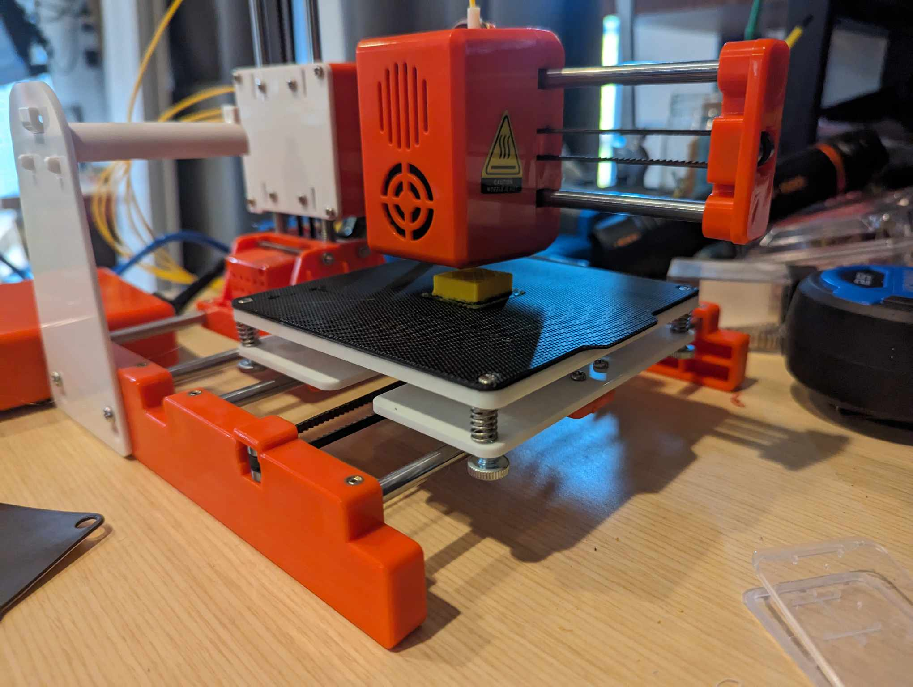

# klipper-EasyThreeD-X1

This is a klipper configuration I made for the EasyThreeD X1 printer. No physical modifications have been made to the printer as the initial goal for this project is to get Klipper working with a stock hardware configuration for this printer.

Currently I do not have the heated bed. 



## Recommended Resources

- [Link to the docs for the "Klipper" firmware](https://www.klipper3d.org/)
- [Zachary 3D Prints - his video (3 parts) on installing klipper on an EasyThreeD X1 printer](https://www.youtube.com/watch?v=PQKtxdus8h8)
- [wodzir's guide to installing klipper on a modified EasyThreeD printer](https://github.com/wodzir/Easythreed-X1-plus/wiki/Klipper-installation)

## My personal goals with this printer:

At first, I want to figure out a working configuration for this printer without making any physical modifications to the actual printer. At some point, I may decide to do some upgrades to this printer (new stepper motors, hot end, extruder, heated bed, etc.) but that will all depend on how much time I have to devote to this project and if I feel its worth my time doing so. Hopefully you may find this helpful in your journey with this printer.

## Klipper Calibration tidbits that helped me:

- Config Checks Doc: https://www.klipper3d.org/Config_checks.html
- Be sure to calibrate the "Z Endstop" (`Z_ENDSTOP_CALIBRATE` Command): https://www.klipper3d.org/Manual_Level.html
- Recommend doing a PID Calibration for extruder:
```
G28
PID_CALIBRATE HEATER=extruder TARGET=215
```
- Don't forget to do a bed screw level adjustment (`BED_SCREWS_ADJUST` Commend): https://www.klipper3d.org/Manual_Level.html#adjusting-bed-leveling-screws

## Cura Settings (I'll add a doc with more on this in the future).

Used EasyThreeD's guides to setting up Cura profile

These are slicer settings to take note of:
- Layer Height: 0.2
- Initial layer height: 0.3
- Line width: 0.4
- Wall thickness: 0.8
- Infill - Lines
- Infill Density: 20%
- Retraction: Enabled
- Retraction Distance: 4.0 mm
- Retraction Speed: 25 mm/s
- Filament: PLA (I've only tested with Sunlu PLA so far)
- print temp: 215C
- Speed: 30 - 40 mm/s
- Travel speed - 120 mm/s (might need to adjust this)
- Print Acceleration: 500mm/s
- Cooling - 100% (0% for first layer)
- Slow Layers: 2
- Z-Hop: Disabled for now

## Known Issues

Please see the [CHANGELOG.md](./klipper/CHANGELOG.md)

## License

Apache 2.0 License: [See here for details](./LICENSE)

## Disclaimer for Custom printer.cfg for EasyThreeD X1
This printer.cfg file is provided as-is and is a custom configuration for the EasyThreeD X1 printer. Users should apply this configuration at their own risk. Key points to note:

- Experimental Configuration: This file was created from scratch based on empirical observations and testing, as official datasheets or detailed specifications for the 24BYJ28 stepper motors, standard in the EasyThreeD X1, were not available.

- Use with Caution: Given the lack of specific technical data, this configuration may not perfectly align with the operational parameters of the EasyThreeD X1 printer. Users are advised to proceed with caution and consider potential risks.

- No Warranty or Guarantee: The creator of this configuration makes no warranty, express or implied, about the suitability, reliability, or accuracy of this configuration for any purpose. The use of this configuration is solely at the user's own risk.

- Feedback and Contributions: Users are encouraged to contribute or provide feedback to further refine and improve this configuration. Your experiences, positive or negative, are valuable for ongoing development.

By using any of the configurations in this repository, you acknowledge and agree to the terms stated in this disclaimer.
